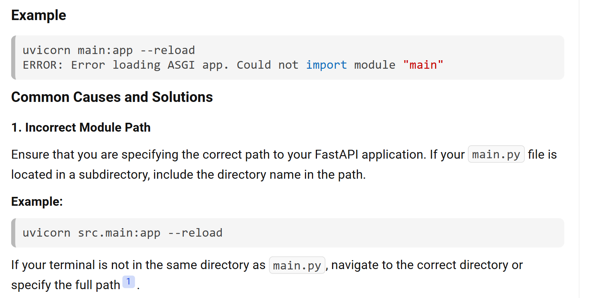

### Install Dependencies


1. Create Venv

```py
python -m venv venv

# activate
Set-ExecutionPolicy RemoteSigned -Scope Process # for powershell
venv\Scripts\activate
```

2. Install
```py
pip install fastapi uvicorn pydantic
```


3. Create a file `main.py`
```py
from fastapi import FastAPI

app = FastAPI()

@app.get("/")
def hello():
    return {"message":"Hello Bhai Log"}
```


4. Execute

```py
uvicorn subdir.filename:objectName --reload

uvicorn 02-hello-world-api.main:app --reload
```



```py
(venv) PS A:\Code\X\fastapi> uvicorn main:app --reload
INFO:     Will watch for changes in these directories: ['A:\\Code\\X\\fastapi']
INFO:     Uvicorn running on http://127.0.0.1:8000 (Press CTRL+C to quit)
INFO:     Started reloader process [8896] using StatReload
ERROR:    Error loading ASGI app. Could not import module "main".
```


